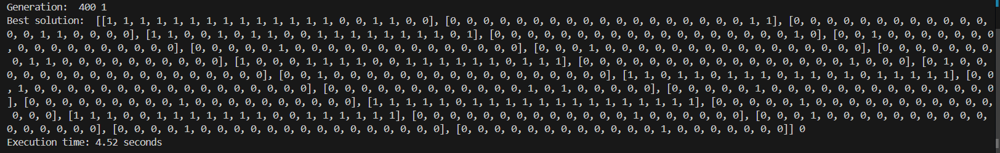
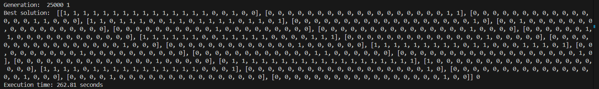

# quick-time-APAE-IA
Repositório com o algoritmo de inteligência artificial para gerar o quadro de horários.

## Funcionamento do algoritmo

Resultado do algoritmo é uma matriz, sendo cada linha uma atividade e cada coluna um período. Onde tem 1 indica que o período é ocupado pela atividade.

Ao encontrar uma solução com 0 conflitos o algoritmo encerra retornando a solução. O máximo de gerações pode ser alterado pelas variáveis de ambiente, por padrão está com 35 mil gerações.

Dessa forma, o tempo para encontrar a solução pode variar:
- Solução encontrada em 4 segundos:

- Solução encontrada em 262 segundos:


### População inicial
A população inicial é gerada conforme:
- a carga horária de cada atividade;
- respeitando a indicação se deve ser geminada; e
- respeitando os períodos indisponíveis.

> :exclamation: Caso não tenha períodos disponíveis suficientes para a carga horária de uma atividade, irá dar erro. Essa validação precisa ser feita antes de chamar esse algoritmo para prevenir quebra.

> :exclamation: Caso um conjuntos de atividades de um mesmo professor, turma ou recurso ultrapasse a carga horária, irá sempre dar conflito até que isso seja alterado no banco de dados.

### Fitness
Na função fitness é contado a quantidade de conflitos que há no indivíduo da população. Cada indivíduo representa uma solução para o quadro de horários. Validações feitas na fitness:
- Conflito de turma: uma mesma turma com mais de uma atividade no mesmo período
- Conflito de professor: um mesmo professor com mais de uma atividade no mesmo período
- Conflito de recurso: um mesmo recurso com mais de uma atividade no mesmo período

### Crossover 
Inicialmente implementado dividindo as ativadades dos pais, da seguinte forma:
- Escolhe um ponto de corte aleatório
- As atividades do pai 1 até o corte vão para o filho A
- As atividades do pai 2 até o corte vão para o filho B
- As atividades do pai 1 após o corte vão para o filho B
- As atividades do pai 2 após o corte vão para o filho A

Podemos considerar, caso necessário, implementar o crossover por períodos. O que implica em organizar novamente a CH e geminação.

### Mutação
A mutação está sendo a alteração aleatória da disposição dos períodos de uma atividade selecionada aleatoriamente dentre as atividades do indivíduo.

## API

Criar ambiente virtual:
```bash
# Windows
py -3 -m venv .venv

# Linux
python3 -m venv .venv
```

Ativar ambiente virtual:
```bash
# Windows
.venv\Scripts\activate

# Linux
. .venv/bin/activate
```

Executar API:
```bash
pip install -r .\requirements.txt

flask --app app run
```